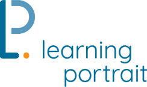

<p align="center">
  
</p>

# Learning Portrait

A gradebook that thinks as you do.

## Overview

Learning Portrait is a Yarn workspace monorepo (monolithic repository).

### Workspaces

-   [api](./api/README.md)
-   [app](./app/README.md)
-   [data-graph](./data-graph/README.md)
-   [design](./design/README.md)

## Getting Started

### Prerequisites

This project uses [Node.js](https://nodejs.org/en) (v20+) and [Yarn](https://yarnpkg.com/getting-started) (v4+) open-source package manager. After installing Node, run the following commands to enable Yarn:

```bash
$ corepack enable
$ yarn set version stable
$ yarn config set nodeLinker "node-modules"
```

### Install

```bash
$ yarn
```

### Generate Keys

To generate random bytes with [openssl](https://www.openssl.org/docs/manmaster/man1/openssl.html), use the openssl rand utility which is the openssl random number generator.

```bash
$ openssl rand -hex 32 | pbcopy
```

## References

### Links

-   [Figma: Learning Portrait v8.1](https://www.figma.com/file/AnL18DKGLfAfbF7G0QdcfU/Learning-Portrait-2.0?type=design&node-id=3440-2834&mode=design)
-   [Figma: Learning Portrait v5](https://www.figma.com/file/AnL18DKGLfAfbF7G0QdcfU/Learning-Portrait-2.0?type=design&node-id=349-1363&mode=design)
