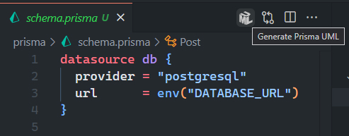

# API

[Learning Portrait API](https://api.learningportrait.com/) is a Next.sjs application with microservice API routes. This API routes connect to PostgresSQL database using Prisma ORM. The routes are decorated with OpenAPI definitions as interactive Swagger UI documentation.

See the [domain model ER](../docs/domain-model.md) for system entities.

## Getting Started

### Install

```bash
$ yarn
```

### Development

```bash
$ yarn dev
```

http://local.learningportrait.com:3800/

## Migrations

Use [Prisma Migrate](https://www.prisma.io/docs/orm/prisma-migrate/workflows/development-and-production) commands in development and production environments.

### Dev

Use the migrate dev command to generate and apply migrations:

```bash
$ yarn db:migrate:dev
```

### Reset

Reset the database to undo manual changes or experiments by running:

```bash
$ yarn db:migrate:reset
```

### Deploy

In production and testing environments, use the migrate deploy command to apply migrations:

```bash
$ db:migrate:deploy
```

> **Note:** migrate deploy should generally be part of an automated CI/CD pipeline, and we do not recommend running this command locally to deploy changes to a production database.

### ER diagram (ERD)

<p align="center">
    
</p>

The [Prisma Generate UML](https://marketplace.visualstudio.com/items?itemName=AbianS.prisma-generate-uml) VS Code extension (`prisma-generate-uml`) creates an ER diagram (ERD) from the [schema.prisma](./prisma/schema.prisma) file.

## References

-   [Next.js](https://nextjs.org/)
-   [Prisma](https://www.prisma.io/)
-   [PostgreSQL](https://www.postgresql.org/)
-   [OpenAPI](https://swagger.io/docs/specification/about/)
-   [Swagger UI](https://github.com/swagger-api/swagger-ui)
