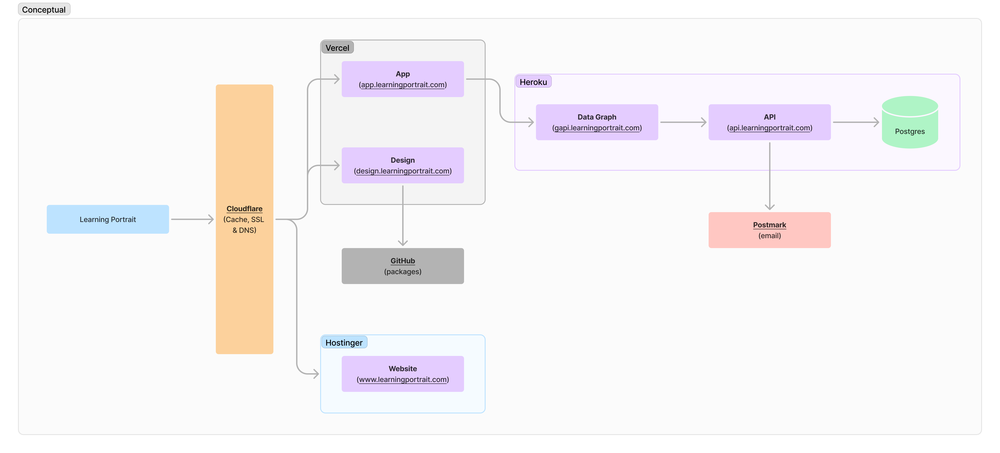

# Docs

## Conceptual Diagram

The Learning Portrait system is simple. The frontend (FE) applications are hosted on Vercel. The backend (BE) applications are hosted in Heroku. Cloudflare is in front everything and hosts DNS as well as proxies and caches network requests and provides security.

The following conceptual system diagram is included to help clarify:

## Design

-   [Figma: UI Mocks](https://www.figma.com/file/AnL18DKGLfAfbF7G0QdcfU/Learning-Portrait-2.0?type=design&node-id=349-1363&mode=design&t=Yn1e9BAz1DQiTfpr-0)
-   [Figma: Conceptual Diagram](https://www.figma.com/file/g26bS4EMhUXdxU1aOwA6RU/Learning-Portrait---Conceptual-Diagram?type=whiteboard&node-id=1%3A401&t=sZMQoP8VWVYroFJ1-1)

### Font

-   [Poppins](https://fonts.google.com/specimen/Poppins)
