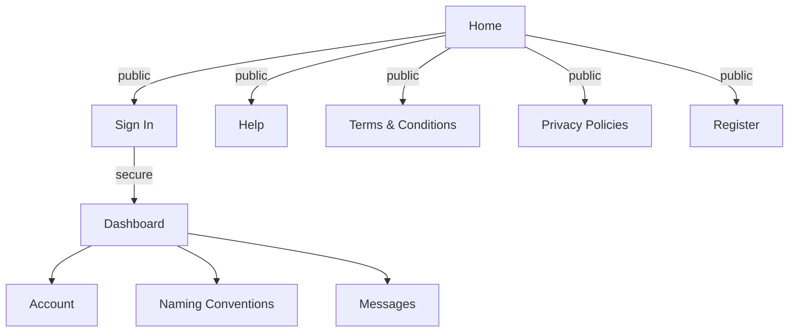

# Application Flow

1. What is the complete user journey in the application?
2. What are they trying to accomplish?
3. How do they know when they're done?

## Flow Diagram

## User Auth

The user journey through the Learning Portrait application has both `public` and `secure` routes. Public routes are 100% accessible to the general public. Anyone can access these resources. Secure routes require the user _authentication_ (AuthN) and _authorization_ (AuthZ) to access the target resource. The process of authenticating and authorizing is known as **User Auth**.
