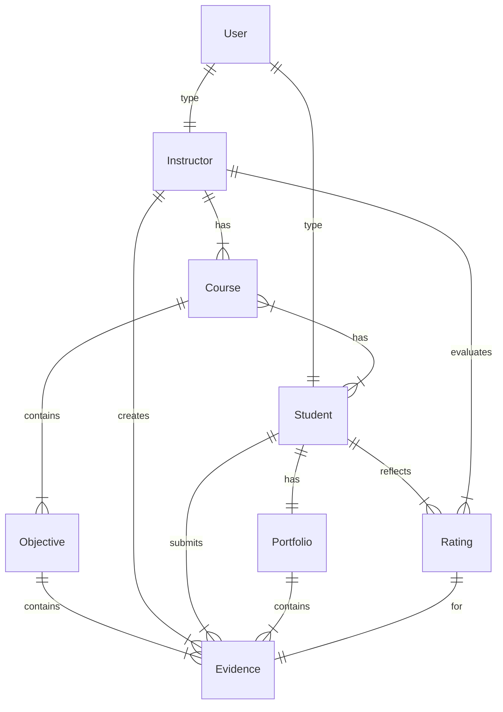
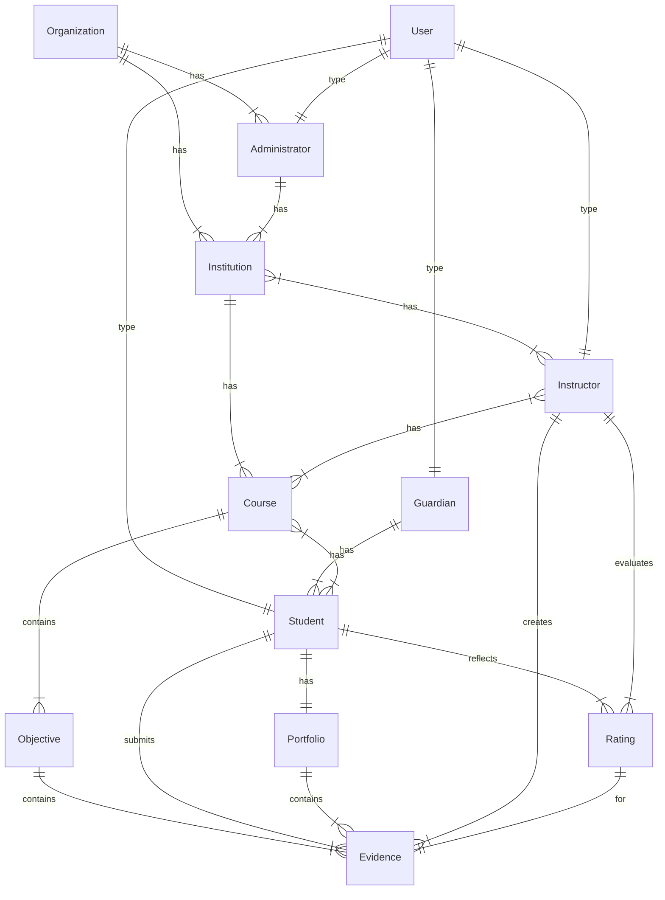

# Domain Model

A domain model is a conceptual representation of a system or subject matter that depicts its key concepts, relationships, and rules. It serves as a visual or diagrammatic tool to help people understand and communicate the structure and behavior of a particular domain or area of interest. In simpler terms, it's like creating a map or blueprint that outlines the important elements and how they relate to each other within a specific context.

## Overview

### Entity Relationship Diagrams (ERD)

> An entity–relationship model (or ER model) describes interrelated things of interest in a specific domain of knowledge. A basic ER model is composed of entity types (which classify the things of interest) and specifies relationships that can exist between entities (instances of those entity types). Wikipedia

### Basic Education System

The following diagram represents a simple relationship between LP system entities. In it the key entities are **users** (_e.g.,_ instructors and students) and **courses** that ancillary entities need to associated with them. In it's simplest form users are connected by courses as either an instructor or student. Additionally, the two user roles are then connected by coursework by **evidence** which is associated to a course by **objectives**.

### Extended Education System

The basic diagram (_above_) lacks the expansive education system representations. A more cohesive diagram would include:

-   Organizations
    -   _e.g.,_ Institution\* system, district, university, etc.
-   Institutions
    -   _e.g.,_ School, training center, etc.
-   Administrators
    -   _e.g.,_ Principal, counselor, advisor, etc.
-   Guardians
    -   _e.g.,_ Parent, legal guardian, etc.

## References

### Links

-   [Mermaid: Entity Relationship Diagrams](https://mermaid.js.org/syntax/entityRelationshipDiagram.html)
